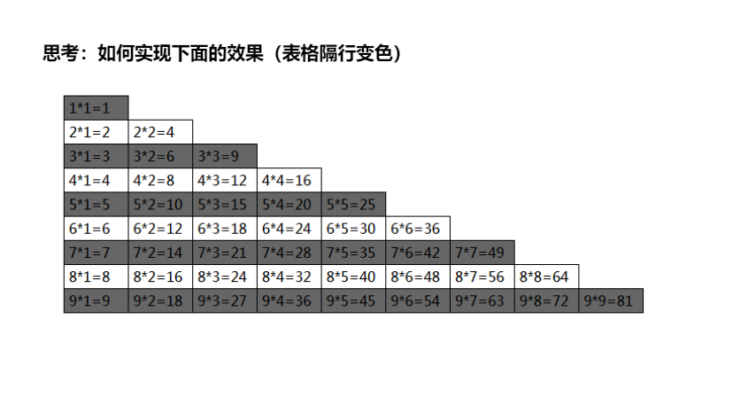
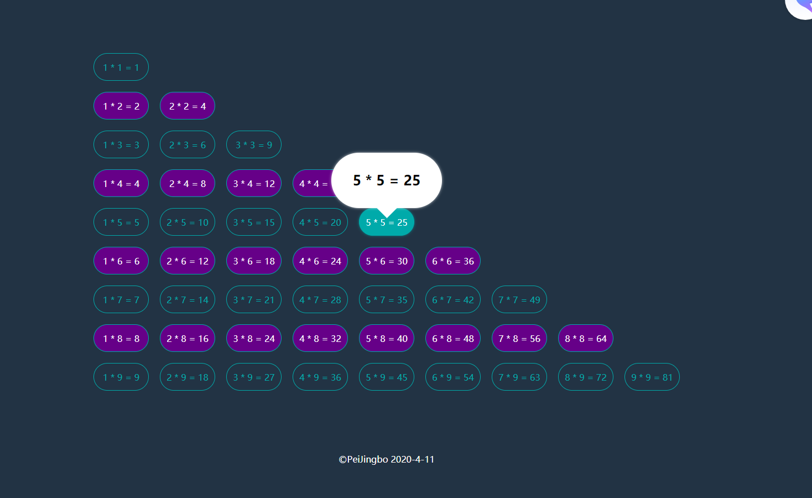

# Web_Homework_Plus
 防止同学抄作业的最佳方式就是吧作业做成抄不起的样子

这是一个记录Web前端学习的仓库,我会将老师布置的作业以一种别人抄不起的样子呈现出来,欢迎指点.

所有项目都在Projects目录中

## 更新日志

## 2020年4月11日

### 作业描述:

使用JavaScript方式在Html中输出九九乘法表

实现方式很简单,使用for循环嵌套进行构造

最终效果(老师的效果)

最终效果(我的实现)

实现方式,老师给出的案例是通过字符串拼接的方式添加html元素

No,No,No

都2020年了

我采用了通过`document.createElement`方法构建一个新的节点并添加到页面上的方法

并且没有丢失嵌套for循环的灵魂

添加了一个鼠标滑过跟随的气泡来展示滑过的内容

知识点:

使用`:nth-child(2n)`伪类来选择双数的行,然后通过后代选择器改变行内列的样式

使用`::after`伪类添加了气泡下面的小尾巴,将伪类设为块元素之后设置宽高并旋转

使用元素的`offsetLeft`属性来获取在父标签中的绝对位置,并通过`offsetParent.offsetLeft`获取父标签在父标签的标签中的绝对位置

相加就是当前元素在文档中的绝对位置

其他的设置位置,展示隐藏都很简单就不多说了,整个gif图瞧一瞧吧

